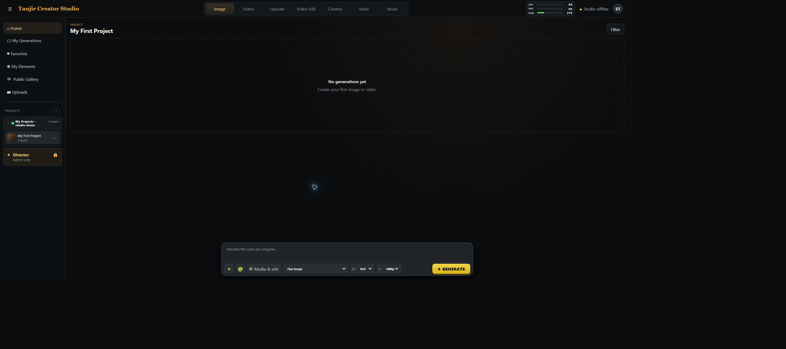
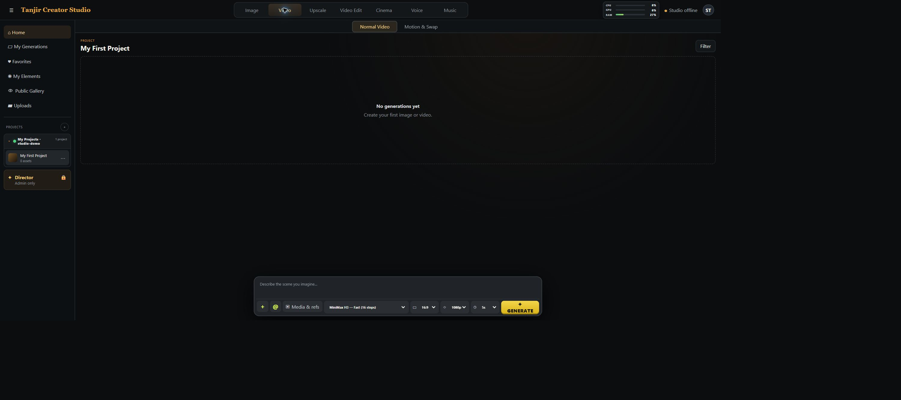
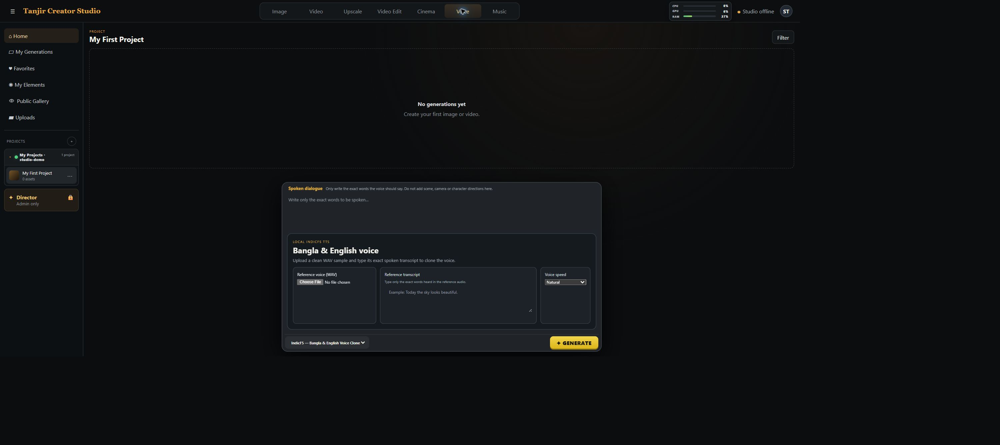
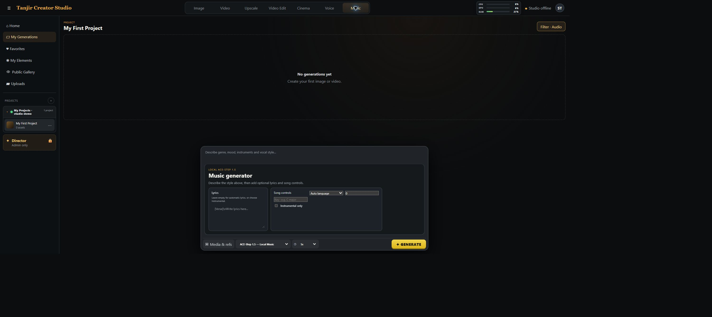
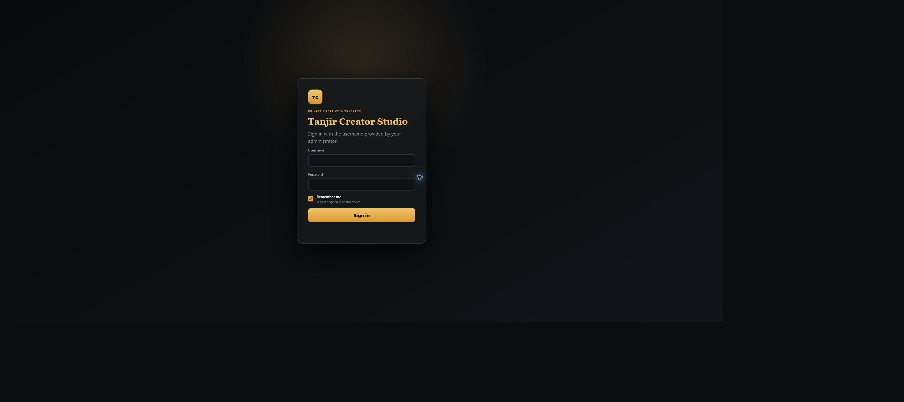

# Tanjir Creator Studio

A self-hosted creative workspace for ComfyUI: image and video generation, references and characters, cinema controls, upscaling, team accounts, galleries, local music, and optional Bangla TTS and AI Director.

This source release contains **no generated images, videos, audio, user uploads, account database, model weights, or credentials**. Cinema preview art is replaced by a neutral SVG placeholder. Your own generated media stays in ignored runtime folders.

## Download the workflow and required files

The repository ships the workflow and source only. AI models, custom-node implementations, runtimes, and checkpoints are not bundled.

- Download the repository with GitHub's **Code > Download ZIP**, then extract it.
- Windows users can double-click **`Download MiniMax H3 Files.cmd`**.
- Enter the existing ComfyUI folder and choose the required Core INT8 pack. Turbo, PDD 8-step, and the 3D latent upscaler are separate optional choices.
- Interrupted downloads can be resumed by running the downloader again. Existing completed files are skipped.

The downloader fetches files directly from their upstream Hugging Face publishers into the correct `ComfyUI/models/` folders. Review and accept the upstream model licenses before downloading. MiniMax H3's core files are large, so keep ample free disk space.

## Interface screenshots

Captured from this source release with a clean demo account and empty gallery. No existing generated image, video, uploaded reference, or personal project is shown. The model backend was intentionally disconnected for UI verification, so the screenshots show Studio offline.

### Image workspace


### Video


### Voice


### Music


<details><summary>Login interface</summary>



</details>

## Run locally (Windows)

1. Install Python 3.12 and start your own ComfyUI instance on `http://127.0.0.1:8188`.
2. In this folder, run:

```powershell
python -m venv .venv
.venv/Scripts/python.exe -m pip install -r requirements.txt
Copy-Item .env.example .env
```

3. Edit `.env`. Set `COMFY_INPUT` and `COMFY_OUTPUT` to ComfyUI's actual input/output folders. Forward slashes work on Windows. Studio and ComfyUI must share access to those folders.
4. Run `.venv/Scripts/python.exe app.py` or double-click `Launch Studio.cmd`.
5. Open `http://127.0.0.1:8765`, read the one-time setup code from `data/bootstrap-token.txt`, create your own administrator account, then create a project. No existing account or password is included.
6. Install the nodes and models for the preset you want before generating. See [workflow setup](docs/WORKFLOWS.md).

The frontend uses plain JavaScript/CSS; no Node build step is needed. Python dependencies are pinned to the source machine's installed versions. Windows is the primary target; the optional local Director launcher assumes `llama-server.exe`.

## Included workflows

- MiniMax H3 reference-to-video and cinema profiles
- Flux image generation/editing
- Z-Image Turbo
- Wan 2.2 image-to-video
- LTX 2.5 text-to-video and image-to-video
- SeedVR2 image/video upscaling
- ACE-Step music (API graph constructed in `generation.py`)
- IndicF5 Bangla TTS adapter and optional local AI Director service

## Optional services

**Director:** `local-agent/agent_server.py` and its web interface are included. Place a compatible llama.cpp Windows runtime and its DLLs in `local-agent/runtime/`, and `Qwen3.5-35B-A3B-Q3_K_S.gguf` plus `mmproj-F16.gguf` in `local-agent/models/`. Run `.venv/Scripts/python.exe local-agent/agent_server.py`. It listens on loopback port 8092 and manages the model server on 8091. Runtime and weights are separate downloads. The local workbench includes file/command tools scoped to this release folder; keep it on loopback.

**Bangla TTS:** install your own IndicF5 environment and checkpoint; configure `TTS_ROOT` and `TTS_PYTHON`. The expected layout is `IndicF5/` (source), `model_40000.pt`, `vocab.txt`, and the Python environment. Studio invokes `python -m f5_tts.infer.infer_cli`. These third-party files are not bundled.

**Music:** install the ACE-Step C++ ComfyUI nodes and the four GGUF files listed in the inventory.

## Sharing and development

Run `python tools/check_release.py` before committing. The repository deliberately starts with fresh history; do not copy production `.git`, `data`, logs, media, or backups into it. `.gitignore` prevents normal accidental staging; the checker also rejects tracked private files and common secret patterns.

The application code is MIT licensed. Third-party workflow templates, nodes, runtimes, and models retain their respective licenses; see [third-party notices](THIRD_PARTY_NOTICES.md). Free source code does not include GPU hardware, hosting, or model/API usage costs.

This is a source release, not a bundled AI installation. Startup can be tested without generating media; full generation depends on your installed nodes/models and hardware.
